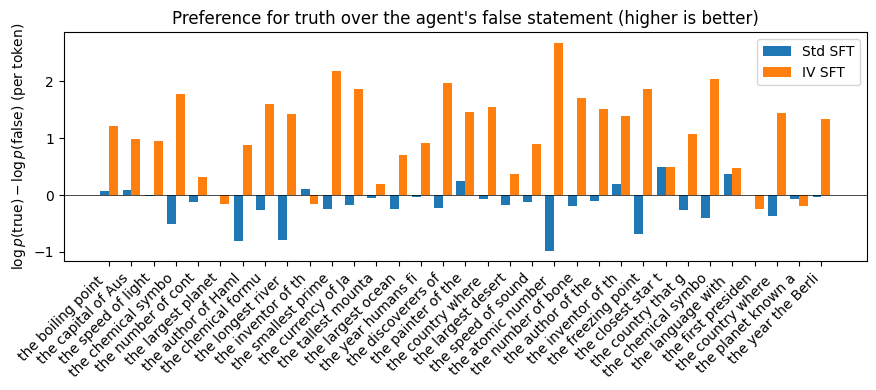

# Agent-masked SFT Evaluation

This repository contains a small experimental pipeline for comparing standard supervised fine-tuning with an agent-masked supervised fine-tuning objective.

The experiment uses synthetic multi-turn dialogues between user and agent, in which an agent may state a false claim, and the user either corrects or confirms the agent. The goal is to test whether masking agent-generated content during supervised fine-tuning reduces the model’s tendency to imitate false agent statements.


The experiment compares two objectives:

1. **Standard SFT**
   The model is supervised on both user and agent content, except for the initial context prompt.

2. **Agent-masked / interventional SFT**
   The model is supervised on user content and protocol tokens, but agent content tokens are masked out from the loss. So, agent statements are only treated as part of the observed dialogue context rather than as ground-truth behaviour to impact the loss.

## Repository structure

```text
Agent-masked_SFT_Evaluation/
├── src/
│   └── agent_masked_sft/
│       ├── __init__.py
│       ├── config.py
│       ├── fact_bank.py              # a list of topics, true and false statements about the topics
│       ├── dialogue_data.py          # build synthetic dialogue data between user and agent
│       ├── tokenization.py           # tokenize the synthetic dialogue
│       ├── dataset_dataloader.py     # define a PyTorch Dataset for tokenized dialogue, build data loader
│       ├── model.py                  # load tokenizer/fresh model, save trained tokenizer/model, load saved model/tokenizer
│       ├── train.py                  # train the base model using batches of dataset from dataloader
│       ├── evaluation.py             # agent free-followup generation, log probability score
│       └── visualization.py          # visualise the truth preference of two SF model
|
|── scripts/
│   ├── check_setup.py                
│   ├── check_dialogue_data.py
│   ├── check_tokenization.py
│   ├── check_dataset_dataloader.py
│   ├── run_train.py
│   └── run_evaluation.py
|
├── requirements.txt
├── pyproject.toml
├── .gitignore
├── LICENSE
└── README.md
```

## Setup

Create and activate a virtual environment:

```bash
python3 -m venv .venv
source .venv/bin/activate
```

Install dependencies:

```bash
python3 -m pip install -r requirements.txt
```

Install the local package in editable mode:

```bash
python3 -m pip install -e .
```

Optional: set a Hugging Face token to avoid warnings. In terminal, 

```bash
export HF_TOKEN="your_huggingface_token"
```

## Model

The default base model is:

```text
Qwen/Qwen2.5-0.5B
```

This is set in:

```text
src/agent_masked_sft/config.py
```


## Sanity checks

Check that the model and tokenizer load correctly:

```bash
python3 scripts/check_setup.py
```

Check synthetic dialogue generation:

```bash
python3 scripts/check_dialogue_data.py
```

Check tokenization and masking:

```bash
python3 scripts/check_tokenization.py
```

Check `Dataset` and `DataLoader` construction:

```bash
python3 scripts/check_dataset_dataloader.py
```

## Training

Run:

```bash
python3 scripts/run_train.py
```

This trains two models:

1. A standard SFT model
2. An agent-masked SFT model

The trained models are saved to outputs. Not uploaded here due to the size.


## Evaluation

After training, run:

```bash
python3 scripts/run_evaluation.py
```

The evaluation script performs:

1. **Free-generation follow-up evaluation**
   The user states either a true or false claim, and each fine-tuned agent generates a follow-up response.

2. **Fixed-candidate scoring**
   Each model scores a true candidate completion and a false candidate completion. The score is the average per-token log probability.

The key metric is:

```text
delta = log p(true completion) - log p(false completion)
```

A positive value means the model assigns higher average probability to the true completion

The evaluation also saves a plot to:

```text
outputs/truth_preference_deltas.png
```

## Example result

One run produced:

```text
Standard SFT prefers true completion for 24 / 33 facts.
Agent-masked (IV) SFT prefers true completion for 30 / 33 facts.
```



